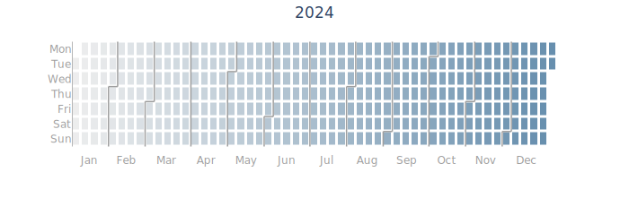
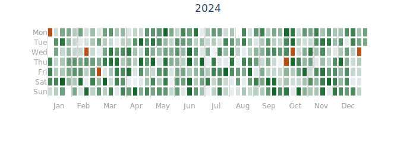

# event-calplot

A Python library for creating beautiful calendar heatmaps with Plotly.

## Features

- GitHub-style calendar heatmaps
- Customizable colors and styling
- Multi-language support (English, Korean)
- Built on Plotly for interactive visualizations
- Event highlighting
- Multi-year support

## Installation

### Using pip

```bash
pip install event-calplot
```

### Using uv

```bash
uv add event-calplot
```


## Quick Start

```python
df = pd.DataFrame({
    'date': pd.date_range('2024-01-01', '2024-12-31'),
    'value': range(366)
})

# Create heatmap
fig = create_calendar_heatmap(
    data=df,
    date_col='date',
    value_col='value',
    year=2024
)
fig.show()
```


## Examples

### Add Event

```python
import numpy as np
import pandas as pd
from event_calplot import create_calendar_heatmap

# Create sample data
df = pd.DataFrame(
    data={
        "date": pd.date_range(start="2024-01-01", end="2024-12-31"),
        "value": np.random.randint(0, 100, size=366),
    }
)

# Event dates
event_dates = pd.to_datetime(
    arg=[
        "2024-01-01",
        "2024-02-14",
        "2024-03-01",
        "2024-10-03",
        "2024-10-09",
        "2024-12-25",
    ]
)

# Create heatmap
fig = create_calendar_heatmap(
    data=df,
    date_col="date",
    value_col="value",
    year=2024,
    min_color="#eff2f5",
    max_color="#116329",
    line_color="#cccccc",
    event_dates=event_dates,
    event_color="#b64f17",
)
fig.show()

```



## API Reference

### `event-calplot`
Create a calendar heatmap for a single year.

**Parameters:**

- `data` (pd.DataFrame): DataFrame containing date and value columns
- `date_col` (str): Name of the date column
- `value_col` (str): Name of the value column
- `year` (int): Year to visualize
- `language` (Literal["en", "ko"], default="en"): Language for labels
- `min_color` (str, default="#eeeeee"): Color for minimum values
- `max_color` (str, default="#678fae"): Color for maximum values
- `line_color` (str, default="#9e9e9e"): Color for month separator lines
- `line_width` (float, default=1.5): Width of month separator lines
- `height` (int, default=250): Height of the plot in pixels
- `hover_template` (Optional[str], default=None): Custom hover template
- `event_dates` (Optional[List[pd.Timestamp]], default=None): Dates to highlight
- `event_color` (str, default="#76cf61"): Color for event markers

**Returns:** `plotly.graph_objs.Figure`

### `create_multi_year_heatmap`

Create calendar heatmaps for all years in the data.

**Parameters:**

- `data` (pd.DataFrame): DataFrame containing date and value columns
- `date_col` (str): Name of the date column
- `value_col` (str): Name of the value column
- `language` (Literal["en", "ko"], default="en"): Language for labels
- `**kwargs`: Additional arguments passed to `create_calendar_heatmap`

**Returns:** `list[plotly.graph_objs.Figure]`

## Architecture

The package is organized into modular components:

- `preprocessing.py`: Data preprocessing and transformation functions
- `layout.py`: Plotly layout configuration
- `traces.py`: Trace creation for heatmaps and lines
- `heatmap.py`: Main API functions

This modular design ensures:
- Each function has a single responsibility
- Easy testing and maintenance
- Clear separation of concerns
- Reusable components

## License

MIT License - see LICENSE file for details

## Contributing

Contributions are welcome! Please feel free to submit a Pull Request.

## Author

Q07K(Gyuhyeong Kim) (kgh0730@gmail.com)

## Links

- GitHub: https://github.com/Q07K/event-calplot
- PyPI: https://pypi.org/project/event-calplot/
